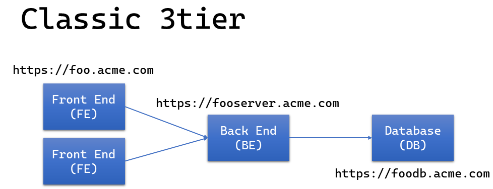

# Classic C# 3tier app to orchestrated container

You'll recognize this classic 3tier architecture:
>

Febedb stands for Front End, Back End, DataBase.

This repo is the chronicles of the transitioning of this classic [3tier app](https://docs.microsoft.com/en-us/dotnet/architecture/modern-web-apps-azure/common-web-application-architectures#traditional-n-layer-architecture-applications) app to one running in an orchestrated container, paving the way towards microservices like [eShopOnContainers](https://github.com/dotnet-architecture/eShopOnContainers) experience.

## Why

This repo exists for a few reasons, but mainly because I've found it challenging (so far) in transitioning from classic/old school development to modern containerized and orchestrated micro-services architecture in the Microsoft world.

Reasons:

1. Outline the process of containerizing an existing 3tier app
1. The challenges of mixing docker, containers, Microsoft .net and Visual Studio (Kestrel)
1. Docker for Windows: Linux containers vs Windows containers
1. Self-signed Certificates for localhost in an orchestrated container world (requirements for gRPC)
1. SQL Server, volumes, dacpac

## Methodology

In order to make this as relevant as possible for everyone, the [technologies](#technologies) and patterns used those that have traditionally used for this (Asp.Net MVC, Web services) and Sql Server.

>[!NOTE]
> This sample is tailored for Microsoft related development tools and frameworks, like Visual Studio, ASP.Net, SQL Server.

The strategy here is a classic [lift and shift](https://docs.microsoft.com/en-us/virtualization/windowscontainers/quick-start/lift-shift-to-containers).  There won't be cooler/better frameworks or patterns used to build modern [frontend](https://docs.microsoft.com/en-us/dotnet/architecture/modern-web-apps-azure/common-client-side-web-technologies) like [Angular](https://angular.io/), [React]()]https://reactjs.org/) or [Vue.js]()]https://vuejs.org/), [backend]() using [Web API](https://docs.microsoft.com/en-us/dotnet/architecture/microservices/microservice-ddd-cqrs-patterns/microservice-application-layer-implementation-web-api) or [gRPC](https://docs.microsoft.com/en-us/dotnet/architecture/cloud-native/grpc), nor any NoSql like [MongoDb](https://www.mongodb.com/).  On the other hand, at the end of the transition, your app will in position/state to make it easy to adopt them.

The chronicles are divided in milestones, or steps.  The src folder contains a sub folder for each step.  Each step has is documented in its own README.md.  

>[!NOTE]
> I tried to be as relevant to the developer's reality in having the executable from either Visual Studio or from the command line.

## Steps

The story begins with the 3 tier app.
>

The [first step](./src/step1.normal/README.md) will be to change to static ports.
>

In [step 2](./src/step2.normal/README.md) we'll try to dockerize our app.
>

We'll hit a few road blocks, which will lead to our last step, with docker-compose. [Step 3 - Docker-Compose](./src/step3.dockercompose/README.md)
>

Our 3tier app can now run in a contained and orchestrated system, runnable from a developer's workstation or docker system.

From there, the sky is the limit, for example Kubernetes, micro-services, modernized frameworks and tools, etc.

## Technologies

Starting technologies and software:

- Visual Studio 2019
- .Net Core 5
- Language: C#
- Frontend: Web App (MVC)
- Backend: Web service
- Database: Sql Server
- Docker
- Kubernetes

> [!Note]
> .Net core 5 is probably more "modern" than your situation, simply [convert](https://github.com/dotnet/try-convert) your .net Framework app.

## Requirements

- Windows 10
- Docker for Windows with Kubernetes - Windows Containers
- WSL2
- Visual Studio 2019
- .Net Core 5.0

## Naming convention for ports

It's easier to troubleshoot errors when ports follow a certain pattern.  The web ports will be using the 5xxx range:

1. First digit: 5 - for convenience.
1. Second digit: step-ish: 0: IIS Express, 1: kestrel, 2: docker, 3: docker-compose, 4: Kubernetes
1. Third digit: 1 = back end, 2 = front end (follows the loading order)
1. Fourth digit 0 = http, 3 = https (like in 0 for 80 and 3 for 443 ;))

## 3 tier applications

For a long time, the [3tier architecture](https://docs.microsoft.com/en-us/dotnet/architecture/modern-web-apps-azure/common-web-application-architectures#traditional-n-layer-architecture-applications) was a well-established software application architecture that organizes applications into 3 logical and physical computing tiers:

- the presentation tier, or user interface
- the application tier, where information is processed
- the data tier, where the data associated with the application is stored

Today, a more modern way of building these is via [microcontainers](https://docs.microsoft.com/en-us/dotnet/architecture/microservices/).

## This is not

This repo is not a course or lecture on micro containers, containers, serverless, or any cloud native technology offerings.
